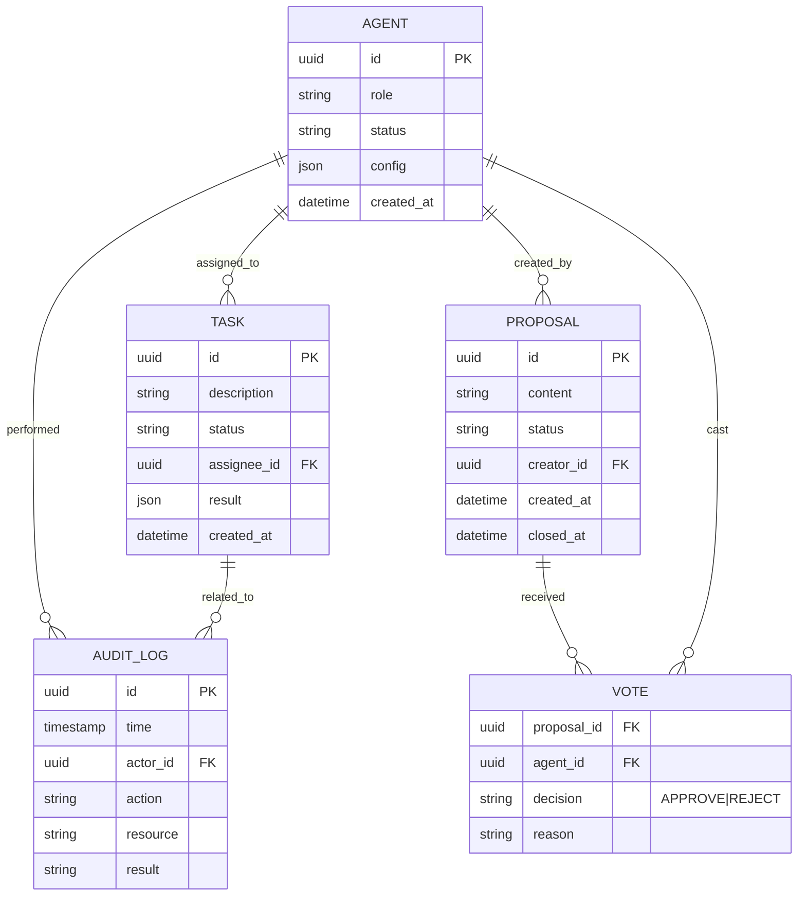

# 使魔团 (ServantGuild) 系统架构设计文档 v1.1

**版本**: v1.1 (Revision)
**状态**: 正式发布
**最后更新**: 2026-02-27
**来源**: 基于 `docs/design/servant_guild_whitepaper_v1.1.md` 与 `docs/architecture/reviews/design_review_01.md`

---

## 1. 业务目标与范围 (Business Goals & Scope)

### 1.1 核心问题
当前的 ZeroClaw 系统是一个单体应用，难以应对复杂的并发任务和自我演进需求。手动维护成本高，且缺乏集体决策机制，容易出现单点故障或不可控行为。我们需要构建一个**自治、协作、进化**的多智能体系统。

### 1.2 目标用户
- **开发者 (Developer)**: 希望通过简单的配置和代码扩展智能体能力。
- **运维人员 (Operator)**: 需要监控系统状态，确保安全运行。
- **最终用户 (User)**: 通过自然语言与智能体交互，完成复杂任务。

### 1.3 关键场景
- **自我进化**: 系统自动发现 Bug，编写修复代码，通过测试并热更新。
- **协作开发**: 多个智能体协同完成一个大型软件项目。
- **安全审计**: 所有高危操作经过审计和投票，确保系统安全。

### 1.4 成功指标
- **自治度**: 90% 的常规维护任务无需人工干预。
- **稳定性**: 核心服务可用性 ≥ 99.9%。
- **效率**: 代码生成与修复速度比人工快 10 倍。
- **安全**: 0 次未授权的高危操作。

---

## 2. 总体架构蓝图 (C4 Model)

### 2.1 Context (系统上下文)
`[PlantUML: docs/architecture/c4_context.puml]`

系统与其外部环境的交互关系：
- **User**: 通过 CLI/Web 交互。
- **GitHub**: 代码托管、版本控制、CI/CD。
- **LLM Providers**: 提供智能推理能力。
- **External Tools**: 外部工具与服务。

### 2.2 Container (容器架构)
`[PlantUML: docs/architecture/container.puml]`

系统内部的容器划分：
- **Master Daemon (Rust)**: 宿主进程，负责 Wasm 运行时管理、消息路由、硬件交互。
- **Core Servants (Wasm)**:
    - **Coordinator**: 协调者。
    - **Contractor**: 契约管理。
    - **Speaker**: 共识引擎。
    - **Warden**: 安全审计。
    - **Worker**: 执行者。
- **Database (PostgreSQL)**: 持久化存储。
- **Cache (Redis)**: 状态缓存。

### 2.3 Component (组件架构)
`[PlantUML: docs/architecture/component.puml]`

以 **Master Daemon** 为例：
- **Runtime Manager**: 管理 Wasm 实例生命周期。
- **Message Bus**: 内部消息总线。
- **Host Functions**: 暴露给 Wasm 的宿主能力（文件、网络、硬件）。
- **Gateway**: 外部 API 网关。
- **Safety Module**: 审慎代理拦截器（审计、快照）。

### 2.4 Code (代码结构)
- `src/runtime/`: Wasmtime 集成。
- `src/servants/`: Wasm 模块实现。
- `src/lib.rs`: 核心 Trait 定义。

---

## 3. 技术选型与约束 (Technology Stack)

### 3.1 核心技术
- **语言**: Rust (1.87+) —— 高性能、内存安全。
- **运行时**: Wasmtime —— 轻量级沙盒、热更新。
- **框架**: Tokio (异步), Axum (Web), Sled (嵌入式 DB)。
- **通信**: Tokio mpsc (内部), gRPC/HTTP (外部)。

### 3.2 数据存储
- **PostgreSQL**: 结构化业务数据、审计日志。
- **Redis**: 临时状态、缓存。
- **Sled**: 嵌入式配置存储。
- **Vector DB (Qdrant/Pgvector)**: 语义记忆检索。

### 3.3 基础设施
- **Docker**: 容器化部署。
- **GitHub Actions**: CI/CD 流水线。
- **Terraform**: 基础设施即代码。

### 3.4 约束条件
- **性能**: Wasm 冷启动 < 5ms。
- **安全**: 所有 Wasm 模块必须签名校验。
- **成本**: 优化 Token 消耗，控制 API 费用。
- **团队**: 全员掌握 Rust 和 Wasm 开发。
- **跨平台**: 核心功能必须在 Linux 和 Windows 上通过测试，macOS 作为开发支持平台。

### 3.5 跨平台技术规范

#### 路径与文件系统
- **路径构建**: 统一使用 `std::path::PathBuf` 或 `path.join()`，禁止字符串拼接路径分隔符。
- **配置目录**: 使用 `dirs` crate 获取平台标准目录：
  ```rust
  let config_dir = dirs::config_dir()
      .expect("Failed to get config directory")
      .join("servant-guild");
  ```
- **临时目录**: 使用 `std::env::temp_dir()` 或 `tempfile` crate。

#### 条件编译
```rust
#[cfg(target_os = "linux")]
mod service {
    pub fn install() { /* systemd */ }
}

#[cfg(target_os = "windows")]
mod service {
    pub fn install() { /* windows service */ }
}

#[cfg(target_os = "macos")]
mod service {
    pub fn install() { /* launchd */ }
}
```

#### Shell 命令适配
```rust
pub fn get_shell_command(command: &str) -> Command {
    #[cfg(target_os = "windows")]
    {
        let mut cmd = Command::new("cmd");
        cmd.args(["/C", command]);
        cmd
    }
    
    #[cfg(not(target_os = "windows"))]
    {
        let mut cmd = Command::new("sh");
        cmd.args(["-c", command]);
        cmd
    }
}
```

### 3.5 安全架构 (Safety & Sandbox)
基于 Wasmtime 的沙盒隔离策略：
- **内存限制**: 每个 Wasm 实例最大内存 512MB。
- **CPU 时间片**: 单次调用最大执行时间 5s (Fuel Consumption)。
- **文件系统**: 仅开放特定的 `preopened_dir` (例如 `/workspace/{agent_id}`)，禁止越权访问。
- **网络**: 白名单机制，仅允许访问配置内的域名。

---

## 4. 核心域与子域划分 (DDD)

### 4.1 领域划分
- **核心域 (Core Domain)**:
    - **Agency Domain**: 智能体协作、任务规划、自我进化。
    - **Consensus Domain**: 提案、投票、决策。
- **支撑域 (Supporting Domain)**:
    - **Security Domain**: 审计、鉴权、沙盒。
    - **Runtime Domain**: Wasm 容器管理、资源调度。
- **通用域 (Generic Domain)**:
    - **Identity Domain**: 用户与智能体身份管理。
    - **Infrastructure Domain**: 数据库、消息队列、网络。

### 4.2 限界上下文 (Bounded Contexts)
- **Coordinator Context**: 任务分发与协调。
- **Contractor Context**: 智能体生命周期管理。
- **Speaker Context**: 投票与共识。
- **Warden Context**: 安全审计与监控。
- **Worker Context**: 具体任务执行。

### 4.3 上下文集成
- **Coordinator -> Worker**: 任务委派 (Command)。
- **Speaker -> All**: 投票请求 (Event)。
- **Warden -> Runtime**: 阻断操作 (Interceptor)。

---

## 5. 数据架构 (Data Architecture)

### 5.1 实体关系图 (ERD)


### 5.2 一致性策略
- **ACID**: 关键业务数据（如配置、审计日志）使用 PostgreSQL 事务。
- **Event Sourcing**: 对共识过程（提案、投票）采用事件溯源，确保可追溯。

### 5.3 存储策略
- **冷热分离**: 活跃任务在 Redis，归档任务在 PostgreSQL。
- **备份恢复**: 每日全量备份，WAL 实时归档，RPO < 5min。

---

## 6. 接口契约 (Interface Contracts)

### 6.1 OpenAPI 规范
详见 `docs/architecture/openapi.yaml`。

### 6.2 Wasm Interface Type (WIT) 契约
宿主暴露给 Wasm 模块的标准能力接口：

```wit
package zeroclaw:host

interface llm {
    record completion-request {
        model: string,
        prompt: string,
        temperature: float32,
    }
    complete: func(req: completion-request) -> result<string, string>
}

interface tool {
    record tool-call {
        name: string,
        args: string, // JSON
    }
    execute: func(call: tool-call) -> result<string, string>
}

interface audit {
    log: func(level: string, message: string)
}

world servant {
    import llm
    import tool
    import audit
    export handle-task: func(task-id: string, input: string) -> result<string, string>
}
```

### 6.3 审慎代理时序图 (Prudent Agency Flow)
`[PlantUML: docs/architecture/prudent_agency_flow.puml]`

1. **Worker** 发起高危操作请求 (e.g., Delete File)。
2. **Host** 拦截请求，转发给 **Warden** (Audit)。
3. **Warden** 批准/拒绝。
4. **Host** 创建系统快照 (Snapshot)。
5. **Host** 执行操作。
6. **Host** 记录审计日志。
7. 若失败，**Host** 回滚快照。

---

## 7. 非功能需求 (NFRs)

- **性能**:
    - QPS: 单节点支持 1000+ 并发请求。
    - RT: 内部通信延迟 < 1ms，API 响应 < 100ms。
    - P99: < 200ms。
- **可用性**:
    - SLA ≥ 99.9%。
    - 故障自动恢复时间 < 1min。
- **可扩展性**:
    - 支持水平扩展，10 倍流量突发扩容 < 5 min。
- **安全**:
    - OWASP Top 10 防护。
    - 严格的 Wasm 沙盒隔离。
    - 全链路 TLS 加密。
- **可观测性**:
    - Trace (OpenTelemetry) + Metric (Prometheus) + Log (Loki)。
    - 告警 < 2 min 到达。
- **可维护性**:
    - 代码覆盖率 ≥ 80%，核心路径 ≥ 90%。
    - 统一的 Rust 代码风格与 Clippy 检查。

---

## 8. 质量属性场景 (ATAM)

| 场景 | 刺激源 | 响应 | 架构决策 |
| :--- | :--- | :--- | :--- |
| **S1: 热更新** | 发现严重 Bug，需紧急修复 | 不停机更新 Wasm 模块，耗时 < 1s | Wasmtime 热替换机制 |
| **S2: 恶意攻击** | 外部注入恶意代码 | 沙盒拦截，审计报警，系统无损 | Wasm 沙盒 + 严格权限控制 |
| **S3: 流量突发** | 并发任务激增 10 倍 | 自动扩容弹性使魔，延迟增加 < 20% | 弹性使魔池 + 异步任务队列 |
| **S4: 节点宕机** | 物理节点故障 | 任务自动重新分发，无数据丢失 | 持久化队列 + 故障转移 |
| **S5: 错误决策** | 智能体做出危险操作 | 监工使魔拦截，需人工确认 | "Prudent Agency" 审计机制 |
| **S6: 协议变更** | 接口版本升级 | 旧版本兼容，平滑迁移 | API 版本控制 + 适配器模式 |

---

## 9. 部署与 DevOps

### 9.1 工作流
- **GitOps**: 基于 GitHub 的 Trunk-Based 开发。
- **MR 模板**: 包含关联 Issue、测试报告、风险评估。

### 9.2 CI/CD 流水线
- **Build**: `cargo build --release` (< 5 min)。
- **Test**: `cargo test` (Unit < 3 min, Integration < 10 min)。
- **Deploy**: 自动构建 Docker 镜像，推送到 Registry，ArgoCD 同步。

### 9.3 环境分级
- **Local**: 开发环境。
- **Dev**: 集成测试环境。
- **Staging**: 预发布环境（类生产）。
- **Prod**: 生产环境。

### 9.4 部署策略
- **蓝绿部署**: 核心服务升级。
- **金丝雀发布**: 智能体版本灰度验证。
- **灾难恢复 (DR)**: 异地多活，定期演练。

### 9.5 跨平台部署架构

ServantGuild 支持在 Linux、Windows、macOS 多平台上部署，提供一致的运行体验。

#### 部署选项矩阵

| 平台 | 推荐方式 | 服务管理 | 配置目录 | 日志目录 |
|------|----------|----------|----------|----------|
| **Linux** | Docker / Kubernetes / Systemd | `systemd` | `/etc/servant-guild/` | `/var/log/servant-guild/` |
| **Windows** | Docker / Windows Service | `sc.exe` / PowerShell | `%ProgramData%\ServantGuild\` | `%ProgramData%\ServantGuild\logs\` |
| **macOS** | Docker / Launchd | `launchctl` | `/usr/local/etc/servant-guild/` | `/usr/local/var/log/servant-guild/` |

#### Linux 部署

**Systemd 服务配置** (`/etc/systemd/system/servant-guild.service`):
```ini
[Unit]
Description=ServantGuild Daemon
After=network.target postgresql.service

[Service]
Type=simple
User=servant-guild
Group=servant-guild
WorkingDirectory=/opt/servant-guild
ExecStart=/opt/servant-guild/bin/servant-guild daemon
Restart=on-failure
RestartSec=5s

[Install]
WantedBy=multi-user.target
```

**部署命令**:
```bash
sudo systemctl daemon-reload
sudo systemctl enable servant-guild
sudo systemctl start servant-guild
```

#### Windows 部署

**Windows Service 注册** (PowerShell 管理员模式):
```powershell
# 安装服务
sc.exe create "ServantGuild" binPath= "C:\Program Files\ServantGuild\bin\servant-guild.exe daemon" start= auto

# 启动服务
sc.exe start ServantGuild

# 查看状态
sc.exe query ServantGuild
```

**PowerShell 服务管理模块** (`src/safety/service/windows.rs`):
```rust
#[cfg(target_os = "windows")]
pub fn install_service(name: &str, path: &Path) -> Result<()> {
    // Windows Service 安装逻辑
}

#[cfg(target_os = "windows")]
pub fn start_service(name: &str) -> Result<()> {
    // Windows Service 启动逻辑
}
```

#### macOS 部署

**Launchd 配置** (`/Library/LaunchDaemons/com.servantguild.daemon.plist`):
```xml
<?xml version="1.0" encoding="UTF-8"?>
<!DOCTYPE plist PUBLIC "-//Apple//DTD PLIST 1.0//EN" "http://www.apple.com/DTDs/PropertyList-1.0.dtd">
<plist version="1.0">
<dict>
    <key>Label</key>
    <string>com.servantguild.daemon</string>
    <key>ProgramArguments</key>
    <array>
        <string>/usr/local/opt/servant-guild/bin/servant-guild</string>
        <string>daemon</string>
    </array>
    <key>RunAtLoad</key>
    <true/>
    <key>KeepAlive</key>
    <true/>
</dict>
</plist>
```

**部署命令**:
```bash
sudo launchctl load /Library/LaunchDaemons/com.servantguild.daemon.plist
sudo launchctl start com.servantguild.daemon
```

#### Docker 统一部署 (推荐)

**Dockerfile**:
```dockerfile
FROM rust:1.87 AS builder
WORKDIR /app
COPY . .
RUN cargo build --release

FROM debian:bookworm-slim
RUN apt-get update && apt-get install -y ca-certificates && rm -rf /var/lib/apt/lists/*
COPY --from=builder /app/target/release/servant-guild /usr/local/bin/
ENTRYPOINT ["servant-guild"]
```

**Docker Compose** (`docker-compose.yml`):
```yaml
version: '3.8'
services:
  servant-guild:
    image: servant-guild:latest
    container_name: servant-guild
    restart: unless-stopped
    volumes:
      - ./config:/etc/servant-guild
      - ./data:/var/lib/servant-guild
      - ./logs:/var/log/servant-guild
    ports:
      - "8080:8080"
    environment:
      - RUST_LOG=info
```

---

## 10. 风险与演进

### 10.1 风险管理
- **技术债**: 定期重构，偿还 Wasm 绑定层的复杂性。
- **单点故障**: Master Daemon 是单点，需通过 HA 方案解决（如 K8s 多副本）。
- **依赖失效**: LLM API 故障降级（切换 Provider 或本地模型）。
- **合规变更**: 持续关注 AI 监管政策，保持数据隐私合规。
- **跨平台兼容性**: 
  - 定期在 CI 矩阵中运行 Linux 和 Windows 测试。
  - 新功能开发时考虑平台差异，使用条件编译隔离。
  - 文件权限和路径处理需在所有支持平台上验证。

### 10.2 演进计划
- **MVP (Phase 1)**: 实现 Wasm 宿主，集成基本工具，单机运行。
- **V1 (Phase 2)**: 实现 5 大核心使魔，共识机制，基本自治。
- **V2 (Phase 3)**: GitHub 集成，自我进化，分布式部署。
