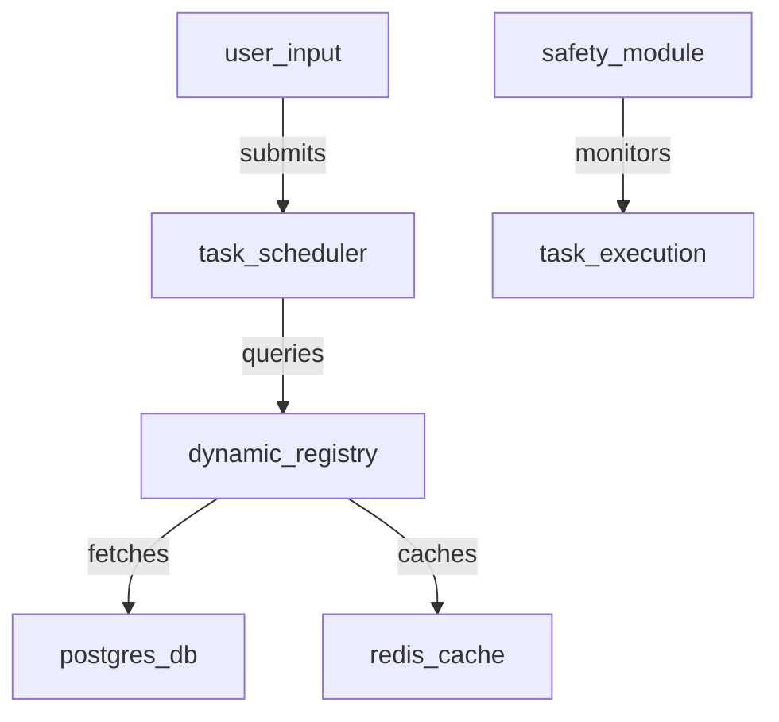
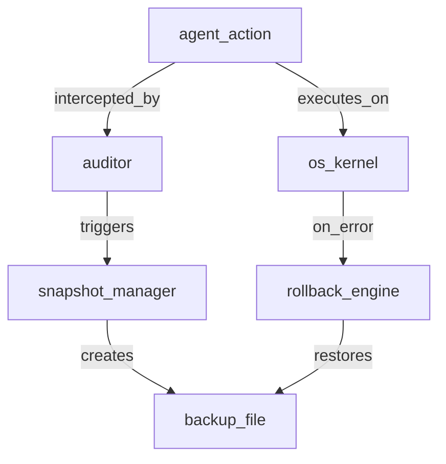
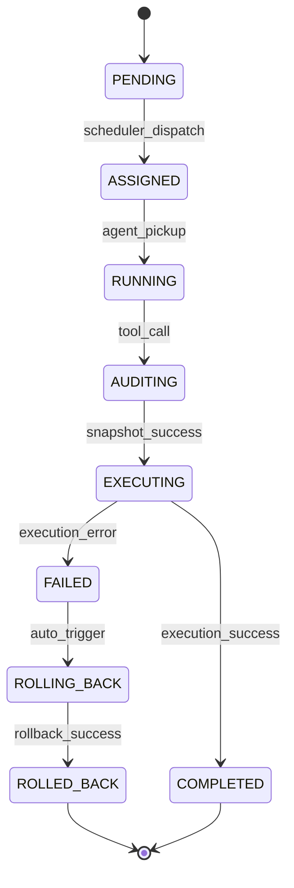

# AI-Oriented System Design Specification

## Background
1.  **System Name**: ZeroClaw Enterprise Agent Platform.
2.  **Current State**: Static Rust binary with TOML configuration.
3.  **Core Issue**: Lack of dynamic extensibility, persistence, and audit trails.
4.  **Privilege Level**: Root/Administrator (Full OS Access).

## Goal
1.  **Architecture**: Transition to Kernel-Dynamic Layered Architecture.
2.  **Extensibility**: Support runtime loading of Agents and Skills via Database.
3.  **Safety**: Implement "Prudent Agency" via Audit & Recovery mechanisms.
4.  **Persistence**: Durable state management using PostgreSQL.

## Constraints
1.  **Performance**: Task scheduling latency < 50ms.
2.  **Security**: All sensitive fields (API Keys) must be encrypted (AES-256-GCM).
3.  **Reliability**: Automated rollback on failure within 5 seconds.
4.  **Environment**: Bare-metal OS (Windows/Linux).

## Module Partitioning

### Core Kernel (Privileged)
1.  **Task Scheduler**: Manages persistent task queues.
2.  **Dynamic Registry**: Handles CRUD for Agents/Skills with caching.
3.  **Crypto Service**: Encrypts/Decrypts sensitive data.
4.  **Safety Module**: Auditor & Snapshot Manager.

*Legend: Core Kernel orchestrates tasks, manages state via DB/Redis, and enforcing safety policies.*

### Safety & Recovery
1.  **Auditor**: Intercepts OS write operations.
2.  **Snapshot Manager**: Creates filesystem/system restore points.
3.  **Rollback Engine**: Reverts state upon failure.

*Legend: Safety module ensures all high-risk operations are audited and reversible via snapshots.*

## Data Flow
1.  **Input Phase**: User -> API -> Task Scheduler (Enqueues Task).
2.  **Dispatch Phase**: Scheduler -> Registry (Loads Agent Profile).
3.  **Execution Phase**: Agent -> LLM -> Tool -> Auditor (Logs Intent).
4.  **Safety Phase**: Auditor -> Snapshot Manager (Backs up) -> OS (Executes).
5.  **Output Phase**: OS -> Auditor (Logs Result) -> Agent -> User.

## State Machine (Task Lifecycle)

*Legend: Task states tracking lifecycle from pending to completion or failure-induced rollback.*

## Interface Contracts

### Agent Registry API
1.  **Create Agent**: `POST /api/v1/agents`
    *   Input: `{ name: String, model: String, system_prompt: String }`
    *   Output: `{ id: UUID, status: "active" }`
2.  **Get Agent**: `GET /api/v1/agents/{id}`
    *   Output: `{ id: UUID, config: JSON, created_at: Timestamp }`

### Safety Module API
1.  **Create Snapshot**: `POST /internal/safety/snapshot`
    *   Input: `{ target_paths: [String], description: String }`
    *   Output: `{ snapshot_id: UUID, path: String }`
2.  **Rollback**: `POST /internal/safety/rollback`
    *   Input: `{ snapshot_id: UUID }`
    *   Output: `{ status: "restored" }`

## Exception Handling
1.  **DB Connection Fail**: Retry 3 times with exponential backoff; downgrade to Read-Only Cache if possible.
2.  **Snapshot Fail**: Abort Task immediately; do not execute OS operation.
3.  **Execution Panic**: Catch unwind; trigger Rollback Engine using last Snapshot ID.

## Test Strategy
1.  **Unit Tests**:
    *   Registry CRUD operations.
    *   Crypto Service AES-256-GCM vectors.
2.  **Integration Tests**:
    *   Full lifecycle: Create Agent -> Assign Task -> Modify File -> Verify Audit Log.
3.  **Chaos Testing**:
    *   Simulate process kill during file write to verify Rollback Engine.

## Deployment Steps
1.  **Database Init**: Run `sqlx migrate run` to create tables.
2.  **Config Import**: Run `zeroclaw migrate` to import `config.toml` to DB.
3.  **Service Start**: Execute `zeroclaw server --port 8080`.
4.  **Health Check**: GET `/health` returns 200 OK.
