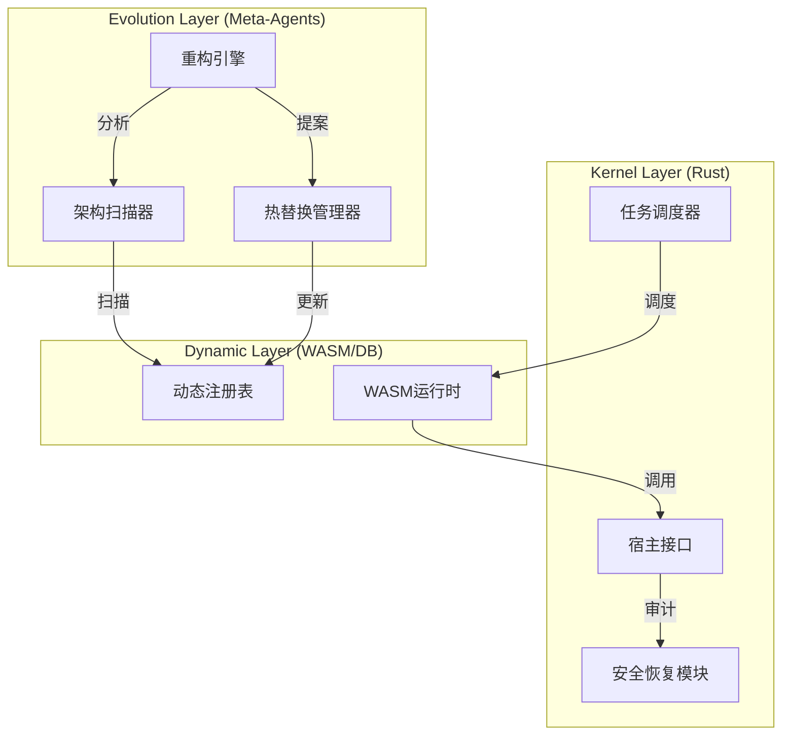
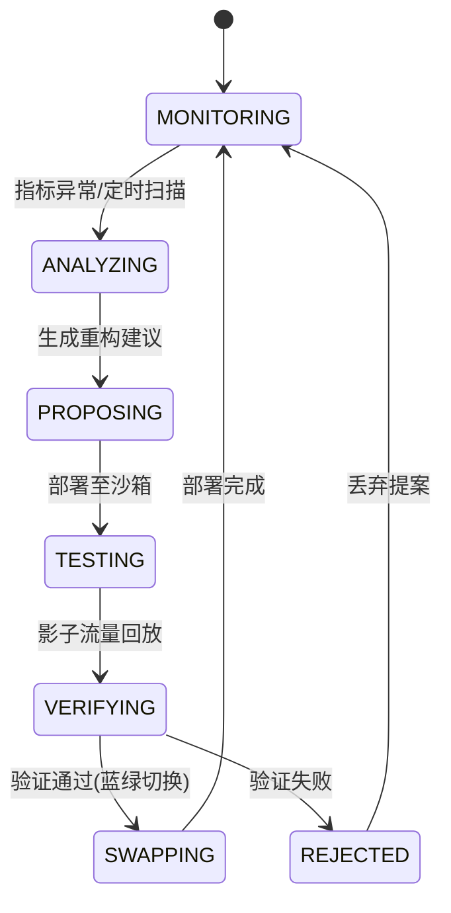

# 面向 AI 的系统设计规格说明书

## 背景
1.  **系统名称**: ZeroClaw 企业级智能代理平台 (ZeroClaw Enterprise Agent Platform)。
2.  **当前状态**: 静态 Rust 二进制文件，正向 **内核-插件-编排器 (Kernel-Plugin-Orchestrator)** 架构演进。
3.  **核心能力**: 具备自我感知、动态演进、热更新能力的生命体系统。
4.  **权限级别**: **Root/管理员 (拥有完整 OS 访问权限)**，配合 **审慎代理 (Prudent Agency)** 机制。

## 目标
1.  **架构**: 实现 **内核 (Kernel)** 与 **动态层 (Dynamic Layer)** 分离。
2.  **自演进**: 系统能够通过元数据驱动 (Metadata-Driven) 和 WASM/脚本化实现逻辑热替换。
3.  **安全性**: 保持审慎代理模型，增加 **沙箱 (Sandbox)** 用于演进测试。
4.  **持久化**: 全量状态 DB 化 (PostgreSQL)，支持版本回溯。

## 约束
1.  **性能**: 任务调度延迟 < 50ms；热替换中断时间 < 100ms。
2.  **安全**: 
    *   **密钥管理**: 主密钥 (Master Key) 环境变量注入；数据密钥 (Data Key) 数据库加密存储。
    *   **分级快照**: 文件级 (File Copy) + 系统级 (VSS/LVM)。
    *   **沙箱隔离**: 动态逻辑运行于 WASM/Deno 环境，通过 Host Function 访问内核。
3.  **可靠性**: 自动回滚触发阈值：新版本错误率 > 0.1%。
4.  **环境**: 裸机操作系统 (Windows/Linux) + WASM 运行时。

## 模块划分

### 核心内核 (特权级 Kernel Layer)
1.  **任务调度器 (Task Scheduler)**: 管理持久化任务队列。
2.  **动态注册表 (Dynamic Registry)**: 存储 Agent/Skill/SOP 定义，支持版本控制。
3.  **安全恢复模块 (Safety & Recovery Module)**: 审计、快照、回滚。
4.  **宿主接口 (Host API)**: 暴露给动态层的受控系统调用。

### 演进层 (Evolution Layer)
1.  **架构扫描器 (Architecture Scanner)**: 解析 Rust 源码 (AST) 和 DB 元数据，生成系统拓扑。
2.  **重构引擎 (Refactoring Engine)**: 分析 OpenTelemetry 指标，生成重构建议 (RFC)。
3.  **热替换管理器 (Hot-Swap Manager)**: 管理 WASM 模块的蓝绿部署 (Blue-Green Deployment)。
4.  **模型路由 (Model Router)**: 支持 A/B 测试与模型衰减检测。

*图例：演进层通过分析系统状态驱动动态层的更新，内核层提供稳定的运行时和安全底座。*

## 数据流
1.  **感知流**: 
    *   Codebase/DB -> 架构扫描器 -> 架构快照 (Architecture Snapshot)。
    *   Runtime Metrics -> 重构引擎 -> 优化提案 (Optimization Proposal)。
2.  **演进流**:
    *   重构引擎 -> 热替换管理器 -> 影子环境 (Shadow Env) -> 流量回放验证。
    *   验证通过 -> 动态注册表 (更新 Version) -> 生产环境生效。
3.  **执行流**:
    *   用户任务 -> 调度器 -> 模型路由 (A/B 分流) -> WASM 代理 -> 宿主接口 -> 安全审计 -> OS 执行。

## 状态机 (演进生命周期)

*图例：系统处于持续的监控-分析-演进闭环中，任何变更需经过沙箱验证。*

## 接口契约

### 演进管理 API
1.  **触发扫描**: `POST /api/v1/evolution/scan`
    *   输入: `{ scope: "full" | "incremental" }`
    *   输出: `{ snapshot_id: UUID, topology_graph: JSON }`
2.  **提交重构提案**: `POST /api/v1/evolution/proposal`
    *   输入: `{ target_module: String, new_version_blob: Base64, strategy: "blue_green" }`
    *   输出: `{ proposal_id: UUID, status: "testing" }`
3.  **执行热替换**: `POST /api/v1/evolution/swap`
    *   输入: `{ proposal_id: UUID, force: Boolean }`
    *   输出: `{ previous_version: String, current_version: String }`

### 动态注册表 API
1.  **注册技能**: `POST /api/v1/registry/skills`
    *   输入: `{ name: String, wasm_binary: Base64, version: SemVer }`
    *   输出: `{ id: UUID }`

## 异常处理
1.  **热替换失败**: 
    *   新版本错误率 > 0.1% -> 立即切回旧版本 (Rollback)。
    *   保留错误日志至 `audit_log`。
2.  **沙箱逃逸**: 
    *   WASM 内存越界 -> Host Runtime 捕获并终止实例。
3.  **决策死循环**: 
    *   同一模块重构建议 24h 内重复出现 -> 标记为 "需人工干预 (Human Intervention)"。

## 测试策略
1.  **影子流量 (Shadow Traffic)**: 
    *   将 1% 生产流量异步复制到沙箱环境的新版本模块。
    *   对比新旧模块输出的一致性 (Consistency Check)。
2.  **性能基准 (Benchmark)**: 
    *   CI/CD 阶段运行标准测试集，Latency 劣化 > 5% 自动阻断。
3.  **红蓝对抗 (Red Teaming)**: 
    *   定期在沙箱中注入恶意 Prompt，验证安全模块拦截能力。

## 部署步骤
1.  **基础架构**: 初始化 PostgreSQL 和 Redis。
2.  **内核启动**: 启动 Rust Kernel，加载 `Safety Module`。
3.  **运行时加载**: 初始化 `Wasmtime` 引擎。
4.  **初始扫描**: 运行 `Architecture Scanner` 建立基准拓扑。
5.  **代理激活**: 从 DB 加载 `Core Agents` (Tony, Lei, etc.) 到内存。
