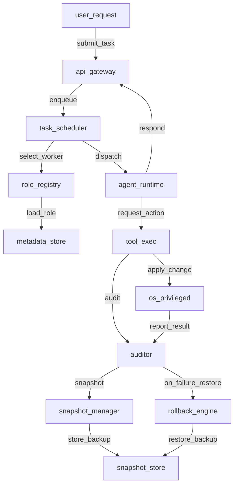

# 架构迁移技术方案（LLM 实施指南）

## 0. 结论

- 本迁移采用“一步到位”策略：直接把 ZeroClaw 从“静态 TOML + 编译期工具集”升级为“DB 驱动的角色/技能/任务/审计/快照体系”。
- 部署模型为“裸机 + Root/Admin 全权限”，不通过行为限制保障安全，而通过“审慎代理（Prudent Agency）= 审计 + 分级快照 + 自动回滚”保障可恢复性。
- 实现时以仓库现有依赖为准：优先使用 `rusqlite` / 可选 `postgres`，优先使用 `chacha20poly1305`（256-bit AEAD）实现机密字段加密。

## 1. 适用范围

- 目标：指导大模型在本仓库内完成架构迁移开发工作，交付可运行的 Phase 1（核心与安全基座）能力，并为 Phase 2（自演进）预留接口。
- 非目标：本文件不要求一次性交付完整企业级全量功能（如大规模分布式部署、全链路 OTEL 全量落地、自动重构闭环上线）。

## 2. 需求基线与变更记录

- 需求基线：`docs/requirements/integrated_srs_v1.0_zh.md`。
- 决策来源：`docs/design/architecture_upgrade_design.md`（v1.4）与后续讨论。
- 关键变更（务必在实现中固化）：
  - SR-007（WASM 沙箱）在本部署模型下不作为强制约束；安全性由“审慎代理（审计 + 快照 + 回滚）”替代。
  - 加密算法从文档中的 AES-256-GCM 改为实现层优先使用 `chacha20poly1305`（256-bit 密钥、AEAD 等价安全目标）；若必须满足 AES 字样，再引入 `aes-gcm`。

## 3. 现状盘点（必须先做）

- 代码入口：
  - CLI：`clap`（见 `Cargo.toml`）。
  - HTTP 网关：`axum`（见 `Cargo.toml`）。
  - 记忆/持久化：`rusqlite`（默认）+ `postgres`（可选 feature）。
  - 日志：`tracing` / `tracing-subscriber`。
  - 指标：`prometheus`。
- 现状关键问题（迁移动因）：
  - 角色/技能/任务以静态配置为主，无法运行时治理。
  - 缺少结构化审计日志与可恢复机制。
  - 缺少持久化任务池与统一调度。

## 4. 目标架构（Phase 1 必须达成）

### 4.1 组件边界

- Kernel（特权）：执行 OS 级动作、统一调度与安全兜底。
- Registry：从 DB 提供角色/技能/合同信息与缓存。
- Scheduler：持久化任务池 + 分配算法。
- Safety：审计器 + 分级快照 + 回滚引擎。
- API：管理面（Admin）与运行面（Gateway）。

## 4.3 多智能体团队（Core Team）

- 核心角色（Core Agents）：
  - Tony（协调者，Coordinator）：冲突检测、观点汇总、权重决策、最终输出。
  - Lei（研究专家，Research Expert）：多源检索、可信度评估、引用溯源。
  - Ben（逻辑专家，Logic Expert）：推理校验、矛盾检测、代码正确性检查。
  - Lisa（创意专家，Creative Expert）：假设挑战、替代方案生成、偏见检测。
- 协作协议（Structured Protocol）：
  - Proposal（提案）-> Challenge（质疑）-> Verification（验证）-> Integration（整合）。
  - 载体：SOP（标准作业程序，Standard Operating Procedure）。

## 4.4 动态扩充治理（Role/Skill Governance）

- 责任主体：资源编排官（Resource Orchestrator，RO），由 Tony 兼任。
- 触发条件（Triggering Events）：新增产品线、技术栈升级、合规变更、性能瓶颈。
- 流程：识别 -> 评估 -> 决策 -> 实施 -> 验收 -> TTL 清理。

## 5. 数据模型（Phase 1 必须落库）

### 5.1 目标表（最小集合）

- `roles`：角色池（核心/合同、状态、提示词等）。
- `skills`：技能池（实现类型、依赖、元数据）。
- `role_skills`：角色-技能绑定（熟练度、使用统计、最近使用时间）。
- `tasks`：任务池（优先级、状态、指派、输入输出摘要）。
- `audit_logs`：审计日志（意图、参数、调用链、结果、耗时）。
- `snapshots`：快照元数据（级别、目标路径、存储位置、回滚动作）。
- `contracts`：合同信息（TTL、续约策略）。

### 5.2 关键字段约束

- `roles.english_name`：唯一。
- `roles.type`：`CORE` | `CONTRACT`。
- `roles.status`：`ACTIVE` | `SUSPENDED` | `ARCHIVED`。
- `tasks.status`：`PENDING` | `ASSIGNED` | `RUNNING` | `COMPLETED` | `FAILED` | `ROLLING_BACK` | `ROLLED_BACK`。
- `skills.dependencies`：JSON 数组（`skill_id` 列表）。

### 5.3 机密字段加密（Envelope Encryption）

- 主密钥（Master Key）：
  - 来源：环境变量（例如 `ZER0CLAW_MASTER_KEY`）。
  - 约束：不落盘、不写日志。
- 数据密钥（Data Key）：
  - 颗粒度：建议按 `role_id` 或 `tenant` 生成。
  - 存储：DB 存储“被主密钥加密的数据密钥”（即密钥封装）。
- 机密字段：
  - `roles.secrets_ciphertext`（密文 JSON）与 `roles.secrets_nonce`。

## 6. 模块实现蓝图（建议文件路径）

- `src/storage/`
  - `mod.rs`：存储抽象 Trait。
  - `sqlite.rs`：`rusqlite` 实现（默认）。
  - `postgres.rs`：`postgres` 实现（feature: `memory-postgres`）。
- `src/registry/`
  - `role_registry.rs`：角色 CRUD + 缓存。
  - `skill_registry.rs`：技能 CRUD + 依赖解析。
- `src/scheduler/`
  - `task_scheduler.rs`：任务入队、分配、状态机推进。
- `src/safety/`
  - `auditor.rs`：统一审计入口（必须覆盖 OS 写操作与命令执行）。
  - `snapshot_manager.rs`：分级快照（File/System）。
  - `rollback_engine.rs`：回滚策略执行。
- `src/api/`
  - `admin.rs`：角色/技能/任务查询与变更。
  - `gateway.rs`：对话入口与任务提交。

## 6.1 模型与路由（Model Pool / Router）

- 复用现有 `src/providers/` 抽象；增加“模型能力画像”（延迟、错误率、成本）字段持久化。
- 最小能力：
  - Primary / Fallback 两级路由。
  - 失败重试与熔断（基于错误率阈值）。

## 6.2 记忆与经验沉淀（Memory Pool / Know-how）

- 复用现有 `src/memory/`；新增两类落库对象：
  - `know_how_patterns`：从任务输入/输出提炼的可复用模式。
  - `skill_usage`：技能调用统计（频次、最近使用）。
- 遗忘机制（Forgetting）：
  - 超过 2 年未使用的技能/经验进入“归档”或“降权”队列（Phase 2 实现）。

## 6.3 自我分析与自主演进（Evolution Layer）

- Architect Agent（架构师元智能体）：
  - Static Scanner：解析 Rust 代码依赖（可先做基于文件/模块的近似拓扑）。
  - Runtime Reflector：基于 DB 中的 `roles/skills/tasks` 输出运行时拓扑。
  - 输出：`architecture_snapshot.json` + Mermaid 图。
- Refactoring Decision（重构决策）：
  - 输入：Prometheus 指标 + 审计失败率 + 资源占用。
  - 输出：RFC（重构建议书），默认需要人工批准（Phase 2）。

## 7. “审慎代理”落地规则（LLM 必须严格遵守）

- 任何可能改变 OS 状态的动作（写文件、删文件、安装软件、改注册表、启动/停止服务）：
  - 先审计：写入 `audit_logs`（意图、参数、调用者、任务 id、trace id）。
  - 再快照：按风险等级选择 Level 1/Level 2。
  - 后执行：执行动作并记录结果。
  - 失败回滚：进入 `ROLLING_BACK`，完成后更新为 `ROLLED_BACK`。
- 风险分级（最小可执行版本）：
  - Level 1（File）：文件备份/回写。
  - Level 2（System）：Windows Restore Point / Linux LVM（Phase 1 可以先实现“文件级 + 预留系统级接口”，但 DB 必须支持 level）。

## 8. API 契约（Phase 1 最小集）

- 管理面（Admin）：
  - `POST /api/v1/roles`
  - `GET /api/v1/roles/{id}`
  - `POST /api/v1/skills`
  - `POST /api/v1/roles/{id}/skills/{skill_id}:bind`
  - `POST /api/v1/tasks`
  - `GET /api/v1/tasks/{id}`
  - `GET /api/v1/audit_logs?task_id=...`
- 安全面（Internal）：
  - `POST /internal/safety/snapshots`
  - `POST /internal/safety/rollbacks`

## 9. 迁移实施步骤（LLM 执行顺序）

1. 建立存储抽象（Storage Trait）与 SQLite 后端（可运行）。
2. 落库 Schema（迁移脚本 + 初始化路径）。
3. 实现 Registry（Role/Skill）+ Redis Read-Through 缓存。
4. 实现 Task Scheduler（状态机、分配算法最小版：按技能匹配 + 空闲度）。
5. 实现 Safety（Auditor + SnapshotManager[File] + RollbackEngine[File]）。
6. 将 OS 写操作统一收敛到 Safety 层（代码中禁止直接 `std::fs::write` / `Command`，必须经过 Safety）。
7. 补齐 API（axum 路由、DTO、鉴权占位）。
8. 补齐测试：单元（加密、快照、回滚）、集成（破坏性 + 自动恢复）。
9. 补齐协作 SOP：将 Proposal/Challenge/Verification/Integration 固化为 SOP 定义与调用。

## 10. 验收标准（Phase 1）

- 数据层：启动后能初始化 DB，并完成 `roles/skills/tasks/audit_logs/snapshots/contracts` 的最小 CRUD。
- 安全层：
  - 任意“写文件”任务都生成审计记录。
  - 任务失败时自动回滚，文件内容恢复一致。
- 调度层：任务从 `PENDING` 走到 `COMPLETED` 或 `ROLLED_BACK`，状态流完整。
- 性能：单机本地（SQLite + Redis 可选）任务入队到 `ASSIGNED` 的 P95 < 50ms。
- 日志：所有审计日志为结构化 JSON（tracing fmt 层输出 JSON 或独立落库）。
- 协作：同一任务在 SOP 流程下能产出“多角色输出 + Tony 汇总”的统一响应。

## 11. 测试策略（必须能自动化）

- 单元测试：
  - 加密：固定向量测试（nonce 长度、密文解密一致）。
  - 快照：对临时目录文件的备份/恢复。
  - 回滚：模拟执行失败触发恢复。
- 集成测试：
  - 创建任务：写入文件 -> 人为注入失败 -> 验证回滚后文件一致。
  - 审计：检查 `audit_logs` 包含意图与参数。
  - 协作：模拟一次 SOP 执行，检查四阶段产物均落库并可追溯。

## 12. LLM 开发操作规范（避免偏航）

- 所有新增依赖必须先核对 `Cargo.toml` 是否已存在；优先复用已有依赖。
- 对现有模块改动必须先检索（按“模块边界/trait/入口”做全局定位），再最小侵入式改造。
- 不允许把密钥、令牌、个人信息写入日志、文档或测试数据。

[ISTJ审计: 结论先行=是 | 基于事实=是 | 情绪偏差=无]
