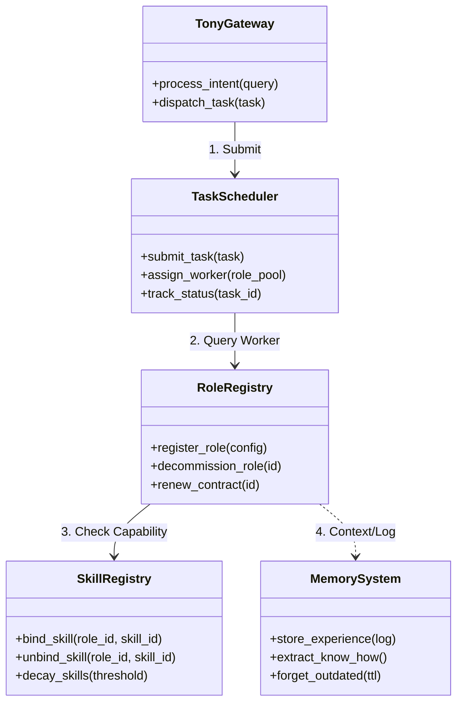

# 企业级智能代理团队管理系统架构评估与设计规范

## 1. 评估结论 (Executive Summary)

基于 ZeroClaw 现有架构（Rust 异步运行时、Trait 驱动的模块化设计、SOP 引擎），**系统具备支持企业级智能代理团队管理的高可行性**，但需从“静态配置驱动”向“动态数据库驱动”进行架构升级。

*   **总体可行性**：**High** (85%)
*   **核心改动**：引入持久化元数据存储 (SQLite/PostgreSQL)、动态注册表 (Registry)、任务调度器 (Scheduler)。
*   **关键瓶颈**：Rust 的静态编译特性限制了原生代码级的“动态技能生成”（需通过脚本引擎或 WASM 解决）。

## 2. 现状与差距分析 (Gap Analysis)

| 需求模块 | 现有架构能力 (ZeroClaw Current) | 差距 (Gap) | 改造难度 |
| :--- | :--- | :--- | :--- |
| **角色池** | `config.toml` 静态配置 `[agents]` | 缺乏运行时增删改查、生命周期状态机 | Medium |
| **技能池** | `src/tools/` 编译期确定的 Tool Trait | 缺乏动态绑定/解绑、依赖管理、使用统计 | High |
| **核心/合同制** | 无此概念，均为无状态 Agent | 需引入 `Contract` 实体、TTL 管理、续约逻辑 | Low |
| **生命周期** | 无自动化流程 | 需开发“入职/离职”SOP、英文名生成器 | Low |
| **遗忘机制** | 向量数据库永久存储 | 需引入时间衰减因子、垃圾回收 (GC) 机制 | Medium |
| **任务池** | SOP `active_runs` (内存态) | 需持久化任务队列、优先级调度、负载均衡 | Medium |
| **Tony 接口** | `Agent::turn` (单轮/多轮对话) | 需增强意图识别路由、多会话状态管理 | Medium |
| **模型池** | `src/providers/` 支持多后端 | 需增加实时性能监控、动态优选算法 | Low |
| **记忆/Know-how** | `Memory` Trait (Vector/SQL) | 缺乏模式提取 (Pattern Mining) 与复用机制 | High |

## 3. 目标架构设计 (Target Architecture)

### 3.1 核心组件图 (Component Diagram)



### 3.2 数据流设计 (Data Flow)

1.  **入职流 (Onboarding)**:
    *   Admin -> `Tony` -> `RoleRegistry.create()` -> 生成 ID/英文名 -> `Contract` (设置 TTL) -> `SkillRegistry.bind(InitialSkills)` -> 存入 DB。
2.  **任务流 (Execution)**:
    *   User -> `Tony` -> `TaskScheduler.push()` -> 匹配最佳 Role (基于技能/负载) -> `Agent.run()` -> 产生 `Log/Artifact` -> `MemorySystem.ingest()`。
3.  **离职流 (Offboarding)**:
    *   Scheduler (Cron) -> 检测 TTL -> 触发 `OffboardingSOP` -> 生成交接文档 -> `MemorySystem.archive()` -> `RoleRegistry.deactivate()`。

## 4. 数据库设计 (Database Schema)

建议使用 SQLite (单机) 或 PostgreSQL (集群) 替代纯文件配置。

```sql
-- 4.1 角色池与合同
CREATE TABLE roles (
    id TEXT PRIMARY KEY, -- UUID
    english_name TEXT UNIQUE NOT NULL, -- 自动生成的英文名
    type TEXT CHECK(type IN ('CORE', 'CONTRACT')),
    status TEXT CHECK(status IN ('ACTIVE', 'SUSPENDED', 'ARCHIVED')),
    system_prompt TEXT,
    created_at DATETIME DEFAULT CURRENT_TIMESTAMP
);

CREATE TABLE contracts (
    role_id TEXT REFERENCES roles(id),
    start_date DATETIME,
    end_date DATETIME, -- 合同制必填
    auto_renew BOOLEAN DEFAULT FALSE,
    terms TEXT -- 合同条款/SLA
);

-- 4.2 技能池
CREATE TABLE skills (
    id TEXT PRIMARY KEY,
    name TEXT NOT NULL,
    description TEXT,
    implementation_type TEXT CHECK(type IN ('NATIVE', 'PYTHON_SCRIPT', 'API_WRAPPER')),
    payload TEXT, -- 脚本内容或API配置
    dependencies TEXT -- JSON array of skill_ids
);

CREATE TABLE role_skills (
    role_id TEXT REFERENCES roles(id),
    skill_id TEXT REFERENCES skills(id),
    proficiency_level INTEGER DEFAULT 1, -- 1-5
    last_used_at DATETIME,
    bind_at DATETIME DEFAULT CURRENT_TIMESTAMP,
    PRIMARY KEY (role_id, skill_id)
);

-- 4.3 任务池
CREATE TABLE tasks (
    id TEXT PRIMARY KEY,
    title TEXT,
    priority INTEGER DEFAULT 0, -- Higher is more urgent
    status TEXT CHECK(status IN ('PENDING', 'ASSIGNED', 'RUNNING', 'COMPLETED', 'FAILED')),
    assigned_role_id TEXT REFERENCES roles(id),
    input_context TEXT,
    output_result TEXT,
    created_at DATETIME,
    completed_at DATETIME
);
```

## 5. 关键功能技术实现方案

### 5.1 动态技能加载 (Dynamic Skills)
*   **挑战**: Rust 是静态编译语言，无法运行时加载新的 Rust 源码。
*   **方案**:
    1.  **脚本化**: 集成 `pyo3` (Python) 或 `deno_core` (JS/TS) 引擎，允许动态加载脚本作为 Tool。
    2.  **配置化**: 对于 HTTP API 类技能，使用通用 `HttpTool` + JSON 配置定义（OpenAPI Spec）。
    3.  **WASM**: (进阶) 支持加载 WASM 模块作为沙箱化技能。

### 5.2 知识遗忘机制 (Forgetting Mechanism)
*   **算法**: `RelevanceScore = VectorSimilarity * TimeDecayFactor`
    *   `TimeDecayFactor = 1 / (1 + decay_rate * days_elapsed)`
*   **实现**:
    *   在 `src/memory/` 中实现 GC 任务。
    *   每日扫描 `role_skills` 表，若 `last_used_at > 2 years`，触发 `unbind` 并归档相关 Vector 索引。

### 5.3 英文名分配系统
*   **实现**: 维护一个 Trie 树或布隆过滤器存储已用名字。
*   **生成策略**: `[Adjective] + [Noun]` 库随机组合，或调用 LLM 生成符合 Role 特质的名字（如 Logic Expert -> "Sherlock"）。

### 5.4 Know-how 提取
*   **机制**: 任务完成后触发 `ReflectionSOP`。
*   **流程**:
    1.  读取 `tasks.input_context` 和 `tasks.output_result`。
    2.  调用 LLM: "Extract reusable patterns from this execution."
    3.  将提取的 Pattern 存入 `skills` 表（作为文本指导或 Prompt 模板）。

## 6. 性能指标与扩展性

| 指标 | 目标值 | 评估方法 |
| :--- | :--- | :--- |
| **角色容量** | > 10,000 | 数据库压力测试 |
| **技能绑定延迟** | < 50ms | 接口响应时间监控 |
| **任务调度吞吐** | > 100 tasks/sec | 并发提交测试 |
| **遗忘处理速度** | < 1h (for 1M records) | 每日 GC 窗口期监控 |

## 7. 测试验证方案

1.  **单元测试**:
    *   验证 `RoleRegistry` 的 CRUD 和 TTL 逻辑。
    *   验证 `TimeDecay` 算法的正确性。
2.  **集成测试**:
    *   **全生命周期测试**: 创建合同工 -> 分配任务 -> 技能绑定 -> 任务完成 -> 合同到期 -> 自动离职 -> 资源释放。
3.  **压力测试**:
    *   同时模拟 100 个 Agent 并发执行任务，监控 SQLite 锁竞争和内存占用。

## 8. 实施路线图 (Roadmap)

*   **Phase 1 (基础架构)**: 引入 SQLite，实现 `RoleRegistry` 和 `SkillRegistry`，替代 `config.toml`。
*   **Phase 2 (生命周期)**: 实现 `Contract` 管理、英文名生成、简单的离职 SOP。
*   **Phase 3 (调度与路由)**: 实现持久化 `TaskPool` 和 Tony 的意图分发。
*   **Phase 4 (高级特性)**: 实现脚本化动态技能、遗忘算法、Know-how 提取。
